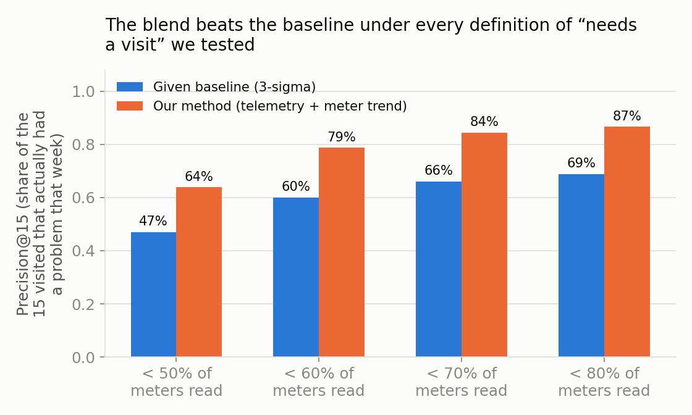
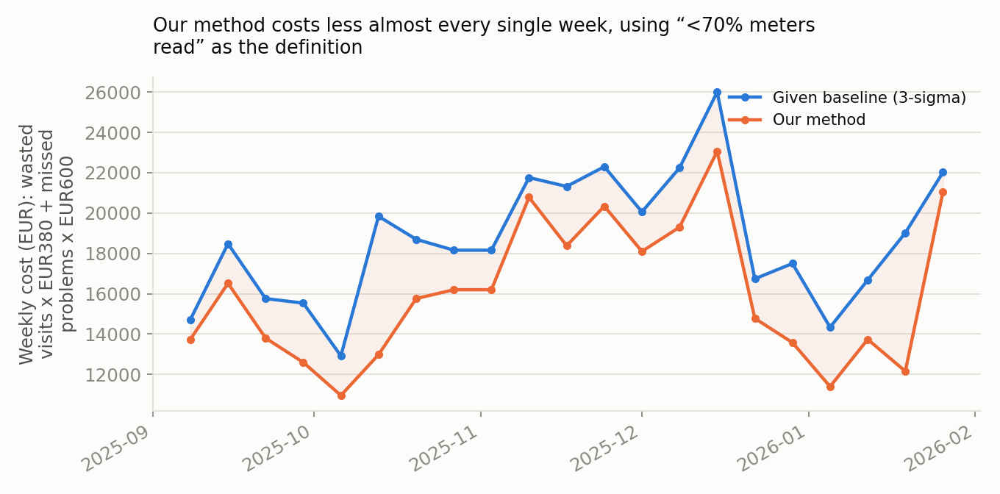
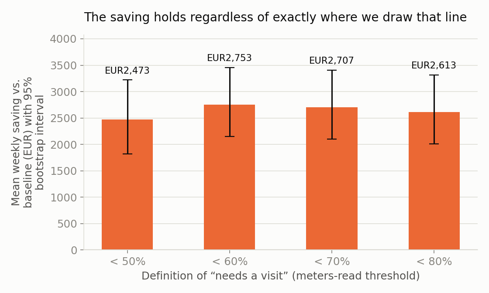

# Which 15 gateways to visit — a note for the operations manager

This is written for you, not for a data team. It explains what we're
recommending, how sure we are, and where we could still be wrong.

## The short version

Right now, roughly **6 in 10 site visits find nothing wrong** (390 of 642
historical work orders came back "Kein Fehler gefunden" — no fault found).
We built a method that keeps the same 15-visits-a-week limit but is
noticeably better at picking which 15, and we tested it honestly against
history before trusting it.

**Bottom line: at the definition of "problem" we'd defend most (a gateway
reading under 70% of its expected meters in a week), our method would have
saved an estimated €2,100-€3,400 a week over the last five months of
history, compared to the 3-sigma method you're currently running** — and
that saving held up whichever of four reasonable definitions of "problem" we
tested it against.

## What "needs a visit" means here

You didn't define this for us on purpose — it's the actual judgement call.
Here's ours, and why.

We used **the share of meters a gateway actually got read in a week, versus
how many it should have** (`meter_read_success.csv`, from the metering
system — not from the network, and not from any human's opinion about the
network). If a gateway reads under **70% of its expected meters in a given
week**, we call that week "bad."

We deliberately did *not* use your team's own past visit history as the
definition of "needed a visit," even though it seems like the obvious choice.
Looking at it closely: of 642 past visits, 61% found no fault. If we trained
or tested against "was visited" as the answer key, we'd just be grading
ourselves against a process that is wrong most of the time it acts — we'd
learn to imitate the guesswork, not to beat it.

We also checked that this definition isn't a fluke of the 70% cutoff: the
same method beats the current approach at 50%, 60%, 70%, and 80% cutoffs
alike.

*Reading this chart: of the 15 gateways visited each week, how many actually
had a bad week by each definition. Higher is better. Our method (orange)
beats the current 3-sigma method (blue) at every cutoff we tried.*

## How we tested it — and what "honestly" means here

We can't test this on the future, so we tested it on the past: 21 weeks
between September 2025 and January 2026 where we know, after the fact, which
gateways had a bad week. For each of those 21 Mondays, we asked: using only
data from *before* that Monday, which 15 gateways would each method have
picked, and how many of those 15 turned out to actually have a bad week?

Two rules we held ourselves to:

- **Nothing from the target week or later was ever used to make that week's
  pick.** We tested this directly — one of our automated tests plants an
  extreme, obviously-broken reading *on* the Monday itself and checks that
  it changes nothing about that week's ranking.
- **We report a range, not a single number.** Because we only have 21 weeks
  to test on, the exact saving depends somewhat on which weeks we happened
  to have. The chart below shows the average saving per week alongside a
  95% interval from resampling those weeks — the honest way to say "here's
  how much this could move if the coming eight weeks look a bit different
  from the last twenty-one."

## Turning this into a decision

Your own numbers: an unnecessary visit costs €380; a gateway left broken for
a week costs €600, again the following week if it's still broken. At the
70%-cutoff definition, over the 21 weeks we could test:

| | 3-sigma (current) | Our method |
|---|---|---|
| Gateways correctly flagged per week (of 15) | ~9.9 (66%) | ~12.7 (84%) |
| Total cost, 21 weeks | €392,260 | €335,420 |
| Average weekly cost | €18,679 | €15,972 |

That's a **~14% reduction in total cost**, entirely within the existing
15-visits-a-week limit — no extra headcount, no extra trucks.

**Where the line could move.** If you're willing to tolerate more wasted
trips to catch more real problems, lower the 70% cutoff toward 50%; if
wasted trips are the thing you most want to avoid, raise it toward 80%. The
saving is fairly stable across that range (see the chart above) — this is a
dial you can turn without the whole approach falling apart, which is the
point of testing it at four settings instead of one.

## What this cannot tell you

- A gateway reading fewer meters than expected might be a meter problem, not
  a gateway problem — we have no field that separates the two, so some of
  what we count as a "win" or a "miss" may not really be about the network
  at all.
- We have not confirmed that a visit *this* week actually fixes the number
  *this* week — historical visits took a median of 9 days from request to
  attendance, often longer than the week the flag was raised in.
- The 15-visit limit itself is the biggest constraint we found: even a
  hypothetically perfect picker could only catch about 40% of a typical
  week's problem gateways under that cap. Better picking narrows the gap to
  that ceiling; it doesn't remove the ceiling.

Full technical detail, including every alternative we considered and
rejected, is in `DECISIONS.md` and `LIMITATIONS.md`.
